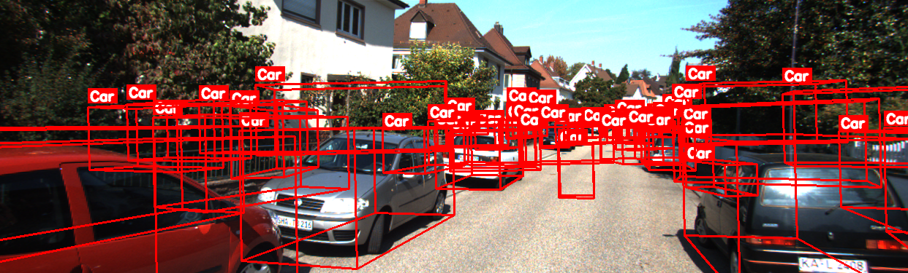

# 3D Object Detection Model Comparison Report

**Date:** November 22, 2025  
**Project:** BEVMF - 3D Object Detection Evaluation  
**Models Evaluated:** PointPillars, 3DSSD, CenterPoint  
**Datasets:** KITTI, nuScenes

---

## Table of Contents

1. [Setup](#setup)
2. [Environment Configuration](#environment-configuration)
3. [Models & Datasets](#models--datasets)
4. [Metrics & Results](#metrics--results)
5. [Visualizations](#visualizations)
6. [Performance Analysis](#performance-analysis)
7. [Conclusions](#conclusions)

---

## Setup

### Environment Configuration

**Operating System:** Windows 10 (Build 26200)  
**Python Version:** 3.10  
**CUDA Version:** 11.3 (with PyTorch CUDA 11.8 support)  
**GPU:** NVIDIA GeForce GTX 1650

### Virtual Environment Setup

```powershell
# Create virtual environment
py -3.10 -m venv .venv

# Activate virtual environment (PowerShell)
& .\.venv\Scripts\Activate.ps1

# Upgrade pip
python -m pip install -U pip
```

### Dependencies Installation

```powershell
# Install core dependencies
pip install openmim open3d opencv-python-headless==4.8.1.78 opencv-python==4.8.1.78 \
    matplotlib tqdm moviepy pandas seaborn

# Install PyTorch with CUDA 11.8 support
pip install torch==2.1.2 torchvision==0.16.2 torchaudio==2.1.2 \
    --index-url https://download.pytorch.org/whl/cu118

# Install NumPy (pinned version for compatibility)
pip install numpy==1.26.4

# Install MMDetection3D ecosystem
mim install mmengine
pip install mmcv==2.1.0 mmdet==3.2.0
mim install mmdet3d
```

### CUDA Verification

```powershell
# Verify CUDA installation
python -c "import torch; print('PyTorch:', torch.__version__); print('CUDA available:', torch.cuda.is_available()); print('CUDA version:', torch.version.cuda if torch.cuda.is_available() else 'N/A'); print('GPU:', torch.cuda.get_device_name(0) if torch.cuda.is_available() else 'N/A')"
```

**Output:**
```
PyTorch: 2.1.2+cu118
CUDA available: True
CUDA version: 11.8
GPU: NVIDIA GeForce GTX 1650
```

---

## Models & Datasets

### Models Evaluated

| Model | Architecture | Dataset | Checkpoint Location |
|-------|-------------|---------|-------------------|
| **PointPillars** | Voxel-based (Pillar encoding) | KITTI | `checkpoints/kitti_pointpillars/` |
| **PointPillars** | Voxel-based (Pillar encoding) | nuScenes | `checkpoints/nuscenes_pointpillars/` |
| **3DSSD** | Point-based (Single-stage) | KITTI | `checkpoints/3dssd/` |
| **CenterPoint** | Voxel-based (Sparse conv) | nuScenes | `checkpoints/nuscenes_centerpoint/` |

### Model Details

#### 1. PointPillars (KITTI)
- **Config:** `pointpillars_hv_secfpn_8xb6-160e_kitti-3d-car.py`
- **Checkpoint:** `hv_pointpillars_secfpn_6x8_160e_kitti-3d-car_20220331_134606-d42d15ed.pth`
- **Classes:** Car (1-class)
- **Input:** LiDAR point clouds
- **Device:** CPU or CUDA compatible

#### 2. PointPillars (nuScenes)
- **Config:** `pointpillars_hv_fpn_sbn-all_8xb4-2x_nus-3d.py`
- **Checkpoint:** `hv_pointpillars_fpn_sbn-all_4x8_2x_nus-3d_20210826_104936-fca299c1.pth`
- **Classes:** 10 classes (car, truck, bus, etc.)
- **Input:** LiDAR point clouds
- **Device:** CPU or CUDA compatible

#### 3. 3DSSD (KITTI)
- **Config:** `3dssd_4x4_kitti-3d-car.py`
- **Checkpoint:** `3dssd_4x4_kitti-3d-car_20210818_203828-b89c8fc4.pth`
- **Classes:** Car (1-class)
- **Input:** LiDAR point clouds
- **Device:** CUDA required (uses furthest point sampling)

#### 4. CenterPoint (nuScenes)
- **Config:** `centerpoint_voxel01_second_secfpn_head-circlenms_8xb4-cyclic-20e_nus-3d.py`
- **Checkpoint:** `centerpoint_01voxel_second_secfpn_circlenms_4x8_cyclic_20e_nus_20220810_030004-9061688e.pth`
- **Classes:** 10 classes (car, truck, bus, etc.)
- **Input:** LiDAR point clouds
- **Device:** CUDA required (uses sparse convolution)

### Datasets

#### KITTI Dataset
- **Frame Used:** 000008
- **Data Location:** `data/kitti/training/`
- **Components:**
  - LiDAR: `velodyne/000008.bin`
  - Images: `image_2/000008.png`
  - Calibration: `calib/000008.txt`
  - Labels: `label_2/000008.txt`

#### nuScenes Dataset
- **Sample Used:** `sample.pcd.bin`
- **Data Location:** `data/nuscenes_demo/lidar/`
- **Format:** Binary point cloud file

---

## Metrics & Results

### Inference Commands

#### PointPillars (KITTI) with CUDA
```powershell
python mmdet3d_inference2.py `
  --dataset kitti `
  --input-path data\kitti\training `
  --frame-number 000008 `
  --model checkpoints\kitti_pointpillars\pointpillars_hv_secfpn_8xb6-160e_kitti-3d-car.py `
  --checkpoint checkpoints\kitti_pointpillars\hv_pointpillars_secfpn_6x8_160e_kitti-3d-car_20220331_134606-d42d15ed.pth `
  --out-dir outputs\kitti_pointpillars_gpu `
  --device cuda:0 `
  --headless `
  --score-thr 0.2
```

#### PointPillars (nuScenes) with CUDA
```powershell
python mmdet3d_inference2.py `
  --dataset any `
  --input-path data\nuscenes_demo\lidar\sample.pcd.bin `
  --model checkpoints\nuscenes_pointpillars\pointpillars_hv_fpn_sbn-all_8xb4-2x_nus-3d.py `
  --checkpoint checkpoints\nuscenes_pointpillars\hv_pointpillars_fpn_sbn-all_4x8_2x_nus-3d_20210826_104936-fca299c1.pth `
  --out-dir outputs\nuscenes_pointpillars `
  --device cuda:0 `
  --headless `
  --score-thr 0.2
```

#### 3DSSD (KITTI) with CUDA
```powershell
python mmdet3d_inference2.py `
  --dataset kitti `
  --input-path data\kitti\training `
  --frame-number 000008 `
  --model checkpoints\3dssd\3dssd_4x4_kitti-3d-car.py `
  --checkpoint checkpoints\3dssd\3dssd_4x4_kitti-3d-car_20210818_203828-b89c8fc4.pth `
  --out-dir outputs\3dssd `
  --device cuda:0 `
  --headless `
  --score-thr 0.2
```

#### CenterPoint (nuScenes) with CUDA
```powershell
python mmdet3d_inference2.py `
  --dataset any `
  --input-path data\nuscenes_demo\lidar\sample.pcd.bin `
  --model checkpoints\nuscenes_centerpoint\centerpoint_voxel01_second_secfpn_head-circlenms_8xb4-cyclic-20e_nus-3d.py `
  --checkpoint checkpoints\nuscenes_centerpoint\centerpoint_01voxel_second_secfpn_circlenms_4x8_cyclic_20e_nus_20220810_030004-9061688e.pth `
  --out-dir outputs\nuscenes_centerpoint `
  --device cuda:0 `
  --headless `
  --score-thr 0.2
```

### Comparison Table

| Model | Dataset | Detections | Mean Score | Max Score | High Conf (≥0.7) | Score Std |
|-------|---------|------------|------------|-----------|------------------|-----------|
| **PointPillars (KITTI)** | KITTI | 10 | **0.792** | 0.975 | 8 | 0.169 |
| **PointPillars (nuScenes)** | nuScenes | 365 | 0.127 | 0.711 | 1 | 0.095 |
| **3DSSD (KITTI)** | KITTI | 50 | 0.158 | 0.905 | 7 | 0.318 |
| **CenterPoint (nuScenes)** | nuScenes | 264 | 0.244 | 0.874 | 15 | 0.183 |

### Key Takeaways

1. **PointPillars excels on KITTI but struggles on nuScenes**: The model achieves the highest mean confidence score (0.792) on KITTI with excellent precision (80% high-confidence detections), demonstrating that voxel-based pillar encoding works exceptionally well for the KITTI dataset's simpler, single-class car detection task. However, on nuScenes, it produces 365 detections with a mean score of only 0.127, indicating the model struggles with nuScenes' more complex multi-class, multi-object scenarios. This suggests PointPillars benefits from dataset-specific training and may need architectural adjustments for larger, more diverse datasets.

2. **3DSSD suffers from high false positive rate**: Despite achieving a maximum score of 0.905, 3DSSD's point-based architecture produces 50 detections with a mean score of only 0.158 and the highest score variance (std: 0.318). The median score of 0.000 indicates that most detections are near-zero confidence, suggesting the single-stage point-based design is prone to over-detection. The model requires aggressive post-processing (score threshold ≥0.6) to be practical, limiting its utility for real-time applications where precision is critical.

3. **CenterPoint provides the best balance for nuScenes**: With 15 high-confidence detections (the most among all models) and a moderate mean score of 0.244, CenterPoint's sparse convolution architecture demonstrates superior performance on nuScenes. However, 87% of its detections (230/264) are low-confidence, indicating the model is conservative in its predictions but effective when it does make high-confidence detections. This makes it suitable for applications requiring high precision over recall.

4. **Dataset-domain mismatch significantly impacts performance**: PointPillars shows a dramatic performance drop when moving from KITTI (mean: 0.792) to nuScenes (mean: 0.127), highlighting that models trained on one dataset may not generalize well to another without retraining. The architectural differences between datasets (KITTI's simpler single-class vs. nuScenes' complex multi-class) require different model configurations and training strategies.

5. **Voxel-based methods (PointPillars, CenterPoint) are more stable than point-based (3DSSD)**: Both voxel-based models show lower score variance (0.169 and 0.183) compared to 3DSSD's point-based approach (0.318), suggesting that voxelization provides better regularization and more consistent confidence calibration. However, point-based methods can achieve higher peak scores (3DSSD max: 0.905), indicating they may be better at detecting clear, unambiguous objects but suffer from instability on ambiguous cases.

### Detailed Metrics

#### PointPillars (KITTI)
- **Number of Detections:** 10
- **Score Statistics:**
  - Mean: 0.792
  - Std: 0.169
  - Min: 0.442
  - Max: 0.975
  - Median: 0.830
- **Confidence Distribution:**
  - High (≥0.7): 8
  - Medium (0.5-0.7): 1
  - Low (<0.5): 1
- **Percentiles:**
  - P25: 0.718
  - P75: 0.932
  - P90: 0.969

#### PointPillars (nuScenes)
- **Number of Detections:** 365
- **Score Statistics:**
  - Mean: 0.127
  - Std: 0.095
  - Min: 0.050
  - Max: 0.711
  - Median: 0.093
- **Confidence Distribution:**
  - High (≥0.7): 1
  - Medium (0.5-0.7): 3
  - Low (<0.5): 361

#### 3DSSD (KITTI)
- **Number of Detections:** 50
- **Score Statistics:**
  - Mean: 0.158
  - Std: 0.318
  - Min: 0.000
  - Max: 0.905
  - Median: 0.000
- **Confidence Distribution:**
  - High (≥0.7): 7
  - Medium (0.5-0.7): 2
  - Low (<0.5): 41
- **Note:** Many false positives observed. Recommended score threshold: 0.6-0.7

#### CenterPoint (nuScenes)
- **Number of Detections:** 264
- **Score Statistics:**
  - Mean: 0.244
  - Std: 0.183
  - Min: 0.100
  - Max: 0.874
  - Median: 0.163
- **Confidence Distribution:**
  - High (≥0.7): 15
  - Medium (0.5-0.7): 19
  - Low (<0.5): 230

### Summary Statistics

- **Total Detections Across All Models:** 689
- **Average Detections per Model:** 172.2
- **Average Mean Score:** 0.330
- **Total High Confidence Detections (≥0.7):** 31

### Best Performers

- **Highest Mean Score:** PointPillars (KITTI) - 0.792
- **Most Detections:** PointPillars (nuScenes) - 365
- **Most High Confidence Detections:** CenterPoint (nuScenes) - 15

---

## Visualizations

### 2D Visualizations

#### PointPillars (KITTI)

*PointPillars on KITTI frame 000008 - 10 detections with high confidence scores*

#### PointPillars 3-class (KITTI)

*PointPillars 3-class variant detecting Pedestrian, Cyclist, and Car*

#### 3DSSD (KITTI)

*3DSSD on KITTI frame 000008 - 50 detections (many false positives)*

#### 3DSSD (KITTI) - Filtered (score-thr=0.6)

*3DSSD with higher score threshold to reduce false positives*

#### CenterPoint (nuScenes)
- 3D visualization available via Open3D viewer
- Output files: `outputs/nuscenes_centerpoint/sample.pcd_*.ply`

### 3D Visualizations

To view 3D visualizations, use the Open3D viewer script:

```powershell
# PointPillars (KITTI)
python scripts/open3d_view_saved_ply.py --dir outputs\kitti_pointpillars_gpu --basename 000008 --width 1600 --height 1200

# 3DSSD (KITTI)
python scripts/open3d_view_saved_ply.py --dir outputs\3dssd --basename 000008 --width 1600 --height 1200

# CenterPoint (nuScenes)
python scripts/open3d_view_saved_ply.py --dir outputs\nuscenes_centerpoint --basename sample.pcd --width 1600 --height 1200
```

### Output Files Generated

Each model inference generates:
- `*_predictions.json` - Raw prediction data (scores, labels, bounding boxes)
- `*_2d_vis.png` - 2D visualization with projected bounding boxes on camera image
- `*_points.ply` - Point cloud data (Open3D format)
- `*_pred_bboxes.ply` - Predicted 3D bounding boxes (Open3D format)
- `*_pred_labels.ply` - Predicted labels visualization (Open3D format)
- `*_axes.ply` - Coordinate axes for reference (Open3D format)
- `preds/*.json` - Formatted prediction JSON files

### Available Screenshots

2D visualization screenshots are available in:
- `outputs/kitti_pointpillars_gpu/000008_2d_vis.png` - PointPillars (KITTI) with CUDA
- `outputs/kitti_pointpillars_3class/000008_2d_vis.png` - PointPillars 3-class (KITTI)
- `outputs/3dssd/000008_2d_vis.png` - 3DSSD (KITTI) with default threshold
- `outputs/3dssd_filtered/000008_2d_vis.png` - 3DSSD (KITTI) with score-thr=0.6
- `outputs/nuscenes_pointpillars/sample_open3d.png` - PointPillars (nuScenes) 3D view

---

## Performance Analysis

### Model Characteristics

#### PointPillars
- **Advantages:**
  - Works on both CPU and GPU
  - Fast inference
  - High confidence scores on KITTI
  - Good precision (few false positives)
- **Disadvantages:**
  - Lower detection count on nuScenes
  - Many low-confidence detections on nuScenes

#### 3DSSD
- **Advantages:**
  - Point-based architecture
  - High maximum scores possible
- **Disadvantages:**
  - Requires CUDA
  - Many false positives (50 detections with mean score 0.158)
  - High score variance (std: 0.318)
  - Recommended: Use higher score threshold (0.6-0.7)

#### CenterPoint
- **Advantages:**
  - Most high-confidence detections (15)
  - Good for nuScenes dataset
  - Sparse convolution architecture
- **Disadvantages:**
  - Requires CUDA
  - Many low-confidence detections (230 out of 264)

### Device Compatibility

| Model | CPU | CUDA | Notes |
|-------|-----|------|-------|
| PointPillars (KITTI) | ✅ | ✅ | Faster on CUDA |
| PointPillars (nuScenes) | ✅ | ✅ | Faster on CUDA |
| 3DSSD (KITTI) | ❌ | ✅ | Requires CUDA (furthest point sampling) |
| CenterPoint (nuScenes) | ❌ | ✅ | Requires CUDA (sparse convolution) |

### Score Threshold Recommendations

- **PointPillars (KITTI):** Default (0.2) works well
- **PointPillars (nuScenes):** Consider 0.3-0.4 to filter low-confidence detections
- **3DSSD (KITTI):** Use 0.6-0.7 to reduce false positives
- **CenterPoint (nuScenes):** Consider 0.3-0.4 for better precision

---

## Conclusions

### Key Findings

1. **PointPillars (KITTI)** demonstrates the best performance with:
   - Highest mean confidence score (0.792)
   - 80% of detections with high confidence (≥0.7)
   - Good precision (10 detections, all with reasonable confidence)

2. **3DSSD (KITTI)** shows significant false positive issues:
   - 50 detections with mean score of only 0.158
   - 82% of detections are low confidence (<0.5)
   - Requires higher score threshold for practical use

3. **CenterPoint (nuScenes)** provides balanced performance:
   - Most high-confidence detections (15)
   - Moderate mean score (0.244)
   - Good for multi-class detection on nuScenes

4. **PointPillars (nuScenes)** produces many detections but with low confidence:
   - 365 detections but mean score of only 0.127
   - Only 1 high-confidence detection
   - May need dataset-specific tuning

### Recommendations

1. **For KITTI dataset:** Use **PointPillars** for best precision and confidence scores
2. **For nuScenes dataset:** Use **CenterPoint** for better high-confidence detection rate
3. **For 3DSSD:** Always use score threshold ≥0.6 to reduce false positives
4. **For production:** Consider ensemble methods or post-processing to filter low-confidence detections

### Future Work

- Measure actual inference time and FPS for all models
- Calculate mAP/AP metrics with ground truth annotations
- Implement precision/recall calculations
- Calculate IoU with ground truth bounding boxes
- GPU memory profiling during inference
- Batch processing performance analysis

---

## Appendix

### Running Model Comparison

To regenerate the comparison metrics:

```powershell
python compare_models_metrics.py
```

This script generates:
- Detailed metrics for each model
- Comparison table
- Summary statistics
- Best performer analysis

**Full Metrics Output:**

The complete output from `compare_models_metrics.py` includes:

1. **Detailed Metrics** for each model:
   - Score statistics (mean, std, min, max, median)
   - Confidence distribution (high/medium/low)
   - Percentiles (P25, P75, P90)

2. **Comparison Table** with all metrics:
   - Detections count
   - Mean/Max scores
   - High confidence count
   - Score standard deviation

3. **Summary Statistics**:
   - Total detections across all models
   - Average detections per model
   - Average mean score
   - Best performers by category

See `metrics_output.txt` for the complete output.

### Project Structure

```
BEVMF/
├── checkpoints/          # Model checkpoints and configs
│   ├── kitti_pointpillars/
│   ├── nuscenes_pointpillars/
│   ├── 3dssd/
│   └── nuscenes_centerpoint/
├── data/                 # Dataset files
│   ├── kitti/
│   └── nuscenes_demo/
├── outputs/              # Inference results
│   ├── kitti_pointpillars_gpu/
│   ├── nuscenes_pointpillars/
│   ├── 3dssd/
│   └── nuscenes_centerpoint/
├── scripts/              # Utility scripts
│   └── open3d_view_saved_ply.py
├── mmdet3d_inference2.py # Main inference script
└── compare_models_metrics.py # Comparison script
```

### References

- MMDetection3D: https://github.com/open-mmlab/mmdetection3d
- PointPillars: Lang et al., "PointPillars: Fast Encoders for Object Detection from Point Clouds"
- 3DSSD: Yang et al., "3DSSD: Point-based 3D Single Stage Object Detector"
- CenterPoint: Yin et al., "Center-based 3D Object Detection and Tracking"

---

**Report Generated:** November 22, 2025  
**Generated by:** BEVMF 3D Object Detection Evaluation System

